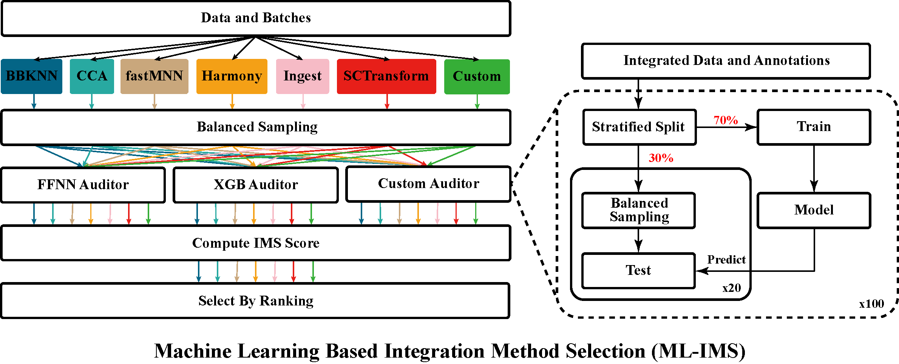

# Tutorial: Detection of Algorithmic and Data Biases in Integrated Single-Cell RNA-Sequencing Datasets

This package aims to detect datasets batch-effects from batch-corrected integrated scRNA-seq datasets and to automaticlly find the best integration methods using Machine Learning Auditors.

The tutorial is arranged as follows:
1. Dependency requirements
2. Data Preparation
3. Test demo

## Dependency requirements
Begin by clone the repository.
```
git clone https://github.com/SheltonZhaoK/Detection-of-Algorithmic-and-Data-Biases-in-Integrated-Single-Cell-RNA-Sequencing-Datasets.git
```
The scripts are written in Python. A virtual python environment can be created with following commands:
``` 
python3 -m venv <dir>
```
The python environment could be activated by:
```
source <dir>/bin/activate
```
The python environment could be deactivated by:
```
deactivate
```
After activating the python virtual environment, all dependencies could be installed by:
```
pip3 install -r requirements.txt
```

## Data Preparation
The package flexibly takes different integrated datasets as an input to the system and allows user to integrate their own datasets with custom integration methods. The only limiatation is that the integrated datasets should have the same naming conventions and be stored in an iterable manner (see the naming convention and arrangment of demo real life datasets).

Here, we provide three demo scripts to preprocess, integrate, and reproduce the real world datasets. The integrations are done in R and Python. Therefore, 4 related R packages should be installed SeuratData, SeuratDisk, scrnabench, and Seurat. If user wants to use their own dataset, one may directly jump to the next section. To be notice, the preprocessing and integration will take a long time for large size real-world datasets. We also uploaded the datasets to be directly used. 

To reproduce the real-world datasets, following commands should be executed:
```
Rscript integrate_real.R
Rscript prepare_real_h5ad.R
Python3 integrated_real.py
```
integrate_real.R and prepare_real_h5ad.R could be run parallely, and integrated_real.py must be run after the execution of prepare_real_h5ad.R.

## Test Demo


